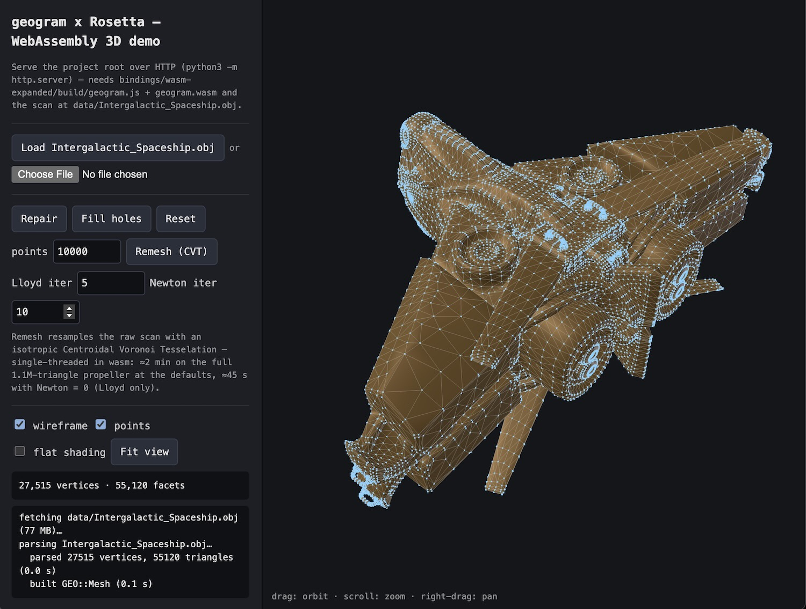

<h1 align="center">Geogram&nbsp;×&nbsp;Rosetta</h1>

<p align="center">
  <em>Automatic, multi-language bindings for Bruno Lévy's geometry-processing library — generated, not hand-written</em>
</p>

<p align="center">
  <a href="https://github.com/BrunoLevy/geogram"></a>
  <a href="https://github.com/xaliphostes/rosetta"></a>
  
  
  
</p>

Language bindings for [Geogram](https://github.com/BrunoLevy/geogram) (a programming library with geometric algorithms) generated by [rosetta](https://github.com/xaliphostes/rosetta) — **Python**, **Node.js**, **WebAssembly**, **TypeScript** and **Lua** from one `manifest.json`, without touching a line of geogram's source.


(The desktop demo `example_python_GUI.py`. Thanks to [askemwhat](https://sketchfab.com/askemwhat) for the 3D model)

## What is bound

| Family | Functions |
|---|---|
| Surface reconstruction | `Co3Ne_smooth`, `Co3Ne_smooth_and_reconstruct` (Co3Ne: smoothing + co-cone triangulation of a point cloud) |
| Remeshing | `remesh_smooth` (isotropic CVT remeshing, Lloyd + Newton), `mesh_repair`, `fill_holes`, `tessellate_facets` |
| Parameterization & texturing | `mesh_make_atlas` (charts + LSCM/ABF/spectral/projection + tetris/xatlas packing), `mesh_get_charts`, `Mesh.tex_coords()` |
| Intersections & Booleans | `mesh_union`, `mesh_intersection`, `mesh_difference`, `mesh_remove_intersections`, `mesh_facets_have_intersection` (exact arithmetic) |
| CSG | `csg_evaluate_string`, `csg_evaluate_file` (OpenSCAD `.csg` programs: `sphere`, `cube`, `cylinder`, `union`, `difference`, `intersection`, `multmatrix`, `hull`, `minkowski`, `linear_extrude`, ...) |

plus the enums `MeshElementsFlags`, `MeshRepairMode`, `ChartParameterizer`, `ChartPacker`, `GEO::Mesh`'s own marshalable methods (`load`, `save`, `copy`, `clear`, `show_stats`, `get_attributes`, ...) and its **member objects** `mesh.vertices` / `mesh.facets` / `mesh.facet_corners` — reference properties over the real stores, through which geometry moves as flat arrays via geogram's own API:

```py
m = geogram.Mesh()
m.facets.assign_triangle_mesh(3, coords, tris, False)   # flat [x,y,z,...] + [v0,v1,v2,...]
m.vertices.nb(), m.facets.nb()
coords = m.vertices.point_coordinates()                 # flat [x,y,z,...] back
```

(`GEO::vector<T>` parameters and returns marshal as plain script arrays through rosetta's `sequences` trait.)

## Why is there still a `src/` folder?

"No facade" removed the wrapper *class* — scripts hold the real `GEO::Mesh`
and the algorithms are bound from geogram's own headers — not the last mile
of glue. Two rounds then shrank this folder further. First, binding-friendly
API additions to geogram (bulk sized accessors `point_coordinates()` /
`vertex_indices()`, type-erased `AttributesManager::get_doubles`/`set_doubles`,
member `Mesh::load`/`save` — upstreamed as geogram PR #373). Second, three
rosetta features: **member-object properties** (`mesh.vertices` /
`mesh.facets` bind as references to the real stores; the manifest `final`
flag suppresses their trampolines so node reaches them too), the
**`sequences` trait** (`GEO::vector<T>` marshals as flat script arrays — and
because the adapters call by name, the first-declared overloads
`assign_points` / `assign_triangle_mesh` bind), which together deleted
`set_points` / `set_surface` / `vertices` / `nb_vertices` / `nb_facets` from
`mesh_ext`. What remains has a specific, known cause:

| File | Why it exists | What would remove it |
|---|---|---|
| `mesh_ext.{h,cpp}` | Two output helpers, `triangles()` and `tex_coords()`: fan-triangulating polygonal facets on read-back is a *policy choice* no binding feature absorbs, and the UVs live in an `Attribute<double>` reached through the type-erased `get_doubles` (an out-parameter `GEO::vector<double>&`, which array marshalling cannot express). | Nothing mechanical — the fan policy stays wherever it is written; the attribute path would need `GEO::Attribute<T>` template-instantiation binding in rosetta. |
| `algorithms.{h,cpp}` | Three things `^^name` splicing can't reach: `initialize()` (imports the CmdLine arg groups the algorithms read; `GEO::initialize` itself is idempotent upstream), the boolean helpers (`GEO::mesh_union` & co are overload sets), and the CSG entry points (`CSGCompiler::compile_*` returns `std::shared_ptr<Mesh>`). | Future rosetta features: a manifest `module_init` hook, overload selection by explicit signature, `shared_ptr` return support. Each deletes its piece. |
| `geogram/version.h` | Artifact of the build strategy, not the binding: geogram's sources are compiled without running geogram's CMake, so the header its CMake would generate must exist somewhere. | Only a prebuilt `libgeogram` (`user_lib`) — which the wasm target can't use. |

## Prerequisites

- clang-p2996 (C++26 reflection fork) at `~/devs/c++/clang-p2996/build` — used **only** to build the generator; the bindings themselves compile with stock toolchains (`*-expanded` targets).
- geogram and rosetta under `extern/` — the bootstrap CMakeLists (step 0) fetches **both**. To use local checkouts instead, put (or symlink) them at `extern/geogram` / `extern/rosetta` before running it: an existing directory is left untouched. geogram needs its submodules (`git clone --recurse-submodules --depth 1 https://github.com/BrunoLevy/geogram extern/geogram`).
- Python 3 + `pybind11` (`pip install pybind11`) for the Python target.
- Node.js (`cmake-js` is installed by `npm i`) for the Node target.
- emsdk (`source ~/emsdk/emsdk_env.sh`) for the WASM target.
- `pip install pyvista pyvistaqt PyQt5` for the desktop viewer (`example_python_GUI.py`) only.

## Build

```bash
# 0. One-time bootstrap: fetch geogram + rosetta into extern/, build rosetta_gen
cmake -B build && cmake --build build

# 1. Generate the generator project from manifest.json, then build it
./extern/rosetta/bin/rosetta_gen manifest.json gen
cmake -S gen -B gen/build && cmake --build gen/build

# 2. Generate all binding projects (bindings/…)
./generator bindings

# 3. Python
cmake -S bindings/python-expanded -B bindings/python-expanded/build
cmake --build bindings/python-expanded/build -j
python3 example_python.py
python3 example_python_GUI.py   # desktop viewer (needs pyvista + pyvistaqt)

# 4. Node.js
(cd bindings/node-expanded && npm i && npm run build)
node example_node.js

# 5. WebAssembly
source ~/emsdk/emsdk_env.sh
emcmake cmake -S bindings/wasm-expanded -B bindings/wasm-expanded/build
cmake --build bindings/wasm-expanded/build -j
node example_wasm.js

# 6. TypeScript declarations (no build needed)
cat bindings/typescript/geogram.d.ts
```

All three examples run the same pipeline — CSG (sphere minus cylinder), the three boolean operations on two overlapping spheres, CVT remeshing of the union to 5000 vertices, LSCM/xatlas UV-atlas generation with UV read-back, then Co3Ne reconstruction of the surface from its bare point cloud — and print the same counts:

```
CSG        : sphere minus cylinder -> 470 vertices, 940 facets
booleans   : union 1580, intersection 812, difference 1196 facets
remeshing  : union remeshed to 5000 vertices, 9996 facets
texturing  : 7 charts, 29988 UV corners in [0.000, 1.000]
reconstruct: Co3Ne rebuilt 9996 facets from the point cloud
```

## Desktop demo (`example_python_GUI.py`)

The screenshot at the top: a pyvista / Qt viewer driving the native Python
binding — same workflow and controls as the browser demo below. Build the
Python target (step 3), `pip install pyvista pyvistaqt PyQt5`, then:

```bash
python3 example_python_GUI.py
```

- **Load** reads `data/Intergalactic_Spaceship.obj` (27.5k vertices /
  55k triangles) natively with `mesh.load()`, so **Open…** accepts any
  format geogram reads (`.obj`, `.off`, `.ply`, `.stl`, `.mesh/.meshb`,
  `.geogram`) — no OBJ parsing in the host language, unlike the wasm demo.
- **Repair** (`mesh_repair`), **Fill holes** (`fill_holes`) and
  **Remesh (CVT)** (`remesh_smooth`, with points / Lloyd / Newton controls)
  run on the `GEO::Mesh`; **Reset** restores the pristine model
  (`Mesh.copy`). The geometry crosses into pyvista as the same flat
  `vertices.point_coordinates()` / `triangles()` arrays the other viewers
  use.
- Display toggles: plain shaded surface (PBR), **wireframe** overlay,
  vertex **points**, flat shading; the log panel prints per-operation
  timings. Native and multi-threaded: the default CVT remesh of the
  spaceship (10k points, 5 Lloyd + 10 Newton) takes **0.4 s** against
  ~20 s in the single-threaded wasm build.

## Browser demo (`index.html`)

The same viewer as a three.js page running the wasm binding in the browser.
Build the WASM target (step 5), then serve the project root over HTTP and
open the page:

```bash
python3 -m http.server        # then http://localhost:8000/
```

- **Load** fetches `data/Intergalactic_Spaceship.obj`; the file picker
  accepts any local `.obj`. The OBJ is parsed in JS (fan-triangulated) and
  pushed into the `GEO::Mesh` through
  `mesh.facets().assign_triangle_mesh(...)` + `mesh_repair` (adjacency) —
  no filesystem in wasm.
- Same algorithm buttons and display toggles as the desktop demo; **Reset**
  restores the pristine scan (`Mesh.copy`).

Everything runs single-threaded in wasm on the main thread — on the bundled
spaceship, repair takes ~0.3 s and the default remesh (10k points,
5 Lloyd + 10 Newton) ~20 s; a 1.1M-triangle scan remeshes in ≈2 min
(Newton = 0 is about 3x faster). The log panel prints per-operation timings.

## Notes

- **CSG dialect**: geogram evaluates the *compiled* OpenSCAD format (`openscad model.scad -o model.csg`). High-level transforms are OpenSCAD sugar — write `multmatrix([[1,0,0,tx],[0,1,0,ty],[0,0,1,tz],[0,0,0,1]]) { ... }` instead of `translate([tx,ty,tz])`.
- Call `initialize(verbose)` first (all the examples do): `mesh.load()`/`mesh.save()` are geogram's own methods and need the I/O handlers that `GEO::initialize` registers. The `georo::` algorithm helpers (booleans, CSG) still run it lazily as a fallback. `initialize(true)` enables geogram's logger (OpenNL solver output is routed through the logger too, so it honors the quiet flag).
- Remeshing can leave higher-dimensional points (normals appended): call `mesh.vertices.set_dimension(3)` before reading `point_coordinates()` back (the examples do).
- On **wasm**, `mesh.vertices()` / `mesh.facets()` are getter *methods* returning borrowed handles (embind properties copy) — don't `.delete()` them, and don't use them after the mesh is gone. embind does not auto-convert JS arrays: use `Module.vector_double` / `Module.vector_unsigned_int` (triangle indices are `index_t`) and call `.delete()` on vectors and meshes (see `example_wasm.js`).
- `mesh_union` / `mesh_intersection` / `mesh_difference` require closed surfaces without self-intersections (that is what the CSG primitives produce; use `mesh_repair` / `mesh_remove_intersections` on wild input). `facets.assign_triangle_mesh` computes no adjacency — run `mesh_repair(M, MESH_REPAIR_DEFAULT, 0.0)` after it before the booleans/remeshing.
- This project is the test case for the rosetta features it motivated: by-reference unwrapping of bound classes in the node runtime, copyability gates in the emitters (skip what would not compile instead of failing the build), manifest `extensions` (free functions as instance methods), member-object reference properties (+ the per-class `final` flag), and the `sequences` trait (`GEO::vector<T>` as flat arrays).